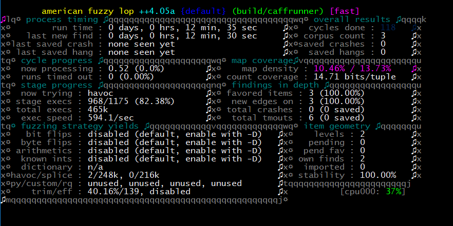

# Libcaff

A Libcaff a házi feladat natív CAFF fájl preview generáló komponense. A komponens CAFF fájlokat tölt be, majd PNG formátumban elmenti az egyik képkocka tartalmát. A PNG fájlok írás az [SPNG](https://libspng.org/) könyvtár segítségével történik, mely tömörítéshez a [miniz](https://github.com/richgel999/miniz)-t használja.

## Fordítás

```
git clone --recursive https://github.com/DRKV333/WannaCrySys
cd WannaCrySys/libcaff
make
```

A projekt submodule-okat használ, így fontos, hogy ne maradjon le a `--recursive`.

A fordításhoz cmake szükséges.

A mellékelt Makefile alap beállításokkal lefordítja az egész projektet a `build` mappában. Ez kézzel is megtehető:

```
mkdir build
cd build
cmake ..
cmake --build .
```

A projekt a következő környezetekben került tesztelésre, itt biztosan megfelelően fordul:

| Platform              | Fordító                  |
| --------------------- | ------------------------ |
| Windows               | MSVC x64 19.33.31629     |
| Windows               | MSYS2 MinGW64 GCC 12.1.0 |
| Ubuntu (Docker Image) | GCC 11.3.0               |
| Ubuntu (Docker Image) | Clang 14.0.6             |

## Felépítés

A Libcaff C++-ban íródott, ám mivel a .NET PInvoke mechanizmusával kell elérhetőnek lennie, publikusan egy C kompatibilis interface-t definiál.

```
bool libcaff_makePreview(const char* inPath, const char* outPath, size_t maxDecodeSize);
```
* inPath: A konvertálandó CAFF fájl útvonala.
* outPath: A kimenetként létrehozandó PNG fájl útvonala.
* maxDecodeSize: Maximálisan mekkora méretű képet dolgozzon fel a könyvtár, a pixelek számának összegében megadva (szélesség * magasság). Ez arányos a maximális memória foglalással.
* Visszatérési érték: `true`, ha a konvertálás sikere volt, egyébként `false`.

```
const char* libcaff_getLastError();
```
* Visszatérési érték: A legutóbb hibásan lefutott konverzió (`false` visszatérési érték) meghiúsulásának okát leíró, null terminált string.

A projekt tartalmaz egy "caffrunner" nevű command line klienst is, mellyel a könyvtár működése egyszerűen tesztelhető.

Maga a Libcaff könyvtár alapértelmezetten egyetlen DLL-re fordul, ezt használja fel a caffrunner. Fuzzolás céljából opcionálisan a `LIBCAFF_STATIC` cmake opcióval a Libcaff statikusan is linkelhető a caffrunner-höz.

## Tesztelés

### SonarLint

A fejlesztés Visual Studio-ban történet, a SonarLint statikus ellenőrző bővítmény használata mellett.

A Sonar Lint segített egy [hiányzó return utasítás](https://github.com/DRKV333/WannaCrySys/commit/5bfb0e5b4678f59b80bd2ae30bd18088182b6adc) megtalálásában, mivel ez "undefined behavior"-t eredményez, potenciálisan biztonsági következményei is lehettek volna.

A Libcaff jelenlegi verziójában két SonarLint warning maradt, melyek elhanyagolhatóak.

> [libcaff.cpp:8](https://github.com/DRKV333/WannaCrySys/blob/0cbb3620e8bad1bdab8246ff8e617b3b797f5e7f/libcaff/src/libcaff.cpp#L8) Warning	cpp:S5421 Global variables should be const.

A módosítható globális változó itt szüksége a C interface megvalósításához.

> [Caff.cpp:20](https://github.com/DRKV333/WannaCrySys/blob/0cbb3620e8bad1bdab8246ff8e617b3b797f5e7f/libcaff/src/Caff.cpp#L20) Warning cpp:S5817 This function should be declared "const".

Ez a függvény igazából jelenleg csak placeholder, a teljes implementáció a Caff osztályba írná a credits blokk tartalmát, így ez nem lehetne const.

### Fordító warning-ok

A projekt az MSVC és GCC fordítókon minden elérhető figyelmeztetés engedélyezése mellett fordul. Ezek a jelenlegi állapotban nem túl hasznosak. Az MSVC rengeteg haszontalan figyelmeztetést ad ki, például arról, hogy egy osztály copy konstruktora implicit delete-elve lett. A GCC figyelmeztet a C++ szabvány szerint a `const char*` bemenetű `Binreader::assertMagic` függvény nem kaphat `std::string` literált. Ez a `-pedantic` kapcsoló használata miatt jelenik, a valóságban használt fordítóknál ez nem okoz gondot.

### AFLplusplus

A Libcaff robusztussága az AFLplusplus fuzzer segítségével került tesztelésre. A fuzzer Docker segítségével, a `fuzzme.bat`/`fuzzme.sh` szkriptekben látható módon futtatható.

A fuzzolás a Libcaff forrásfájljaira korlátozott, hiszen a függőségeit, már azok készítője fuzz tesztelésnek vetette alá.

A házi feladathoz kiadott CAFF példa fájlok sajnos nagy méretükből kifolyólag nem voltak alkalmasak a fuzzoláshoz, így egyetlen kézzel készített bemenet szolgál a fuzzer input korpuszaként.



A fuzzolás nem produkált semmilyen érdekes eredményt, feltehetőleg részben az input fájlok kis száma miatt.